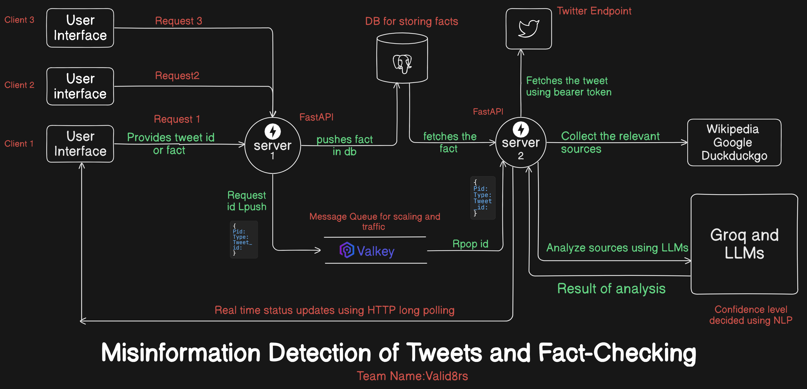

### VALID8RS ###
# Valid8: AI-Powered Fact-Checking System

Valid8 is a **fact-checking and analysis system** that utilizes a **completely open-source technology stack** to verify information efficiently. It features a **Uvicorn-powered FastAPI server** that retrieves sources from **DuckDuckGo, Google, and Wikipedia** to provide reliable references.  

The system can **analyze tweets using their Tweet ID**, making it easy to fact-check social media claims. Additionally, a **browser extension** enables users to select any text on a webpage and instantly analyze its credibility across the internet.  

To process and structure retrieved data, the system leverages **Groq** for optimized querying. The information is then analyzed by **Mistral** and **LLaMA 3.1**, both open-source LLMs, to determine the accuracy of the given fact.  

You can check out the demo [here](https://youtu.be/R2Cqx147jU4)
## 🌟 Features

- **Real-time Tweet Analysis**: Fetch and analyze tweets instantly
- **Multi-Source Verification**: Aggregate data from Google, DuckDuckGo, and Wikipedia
- **Chrome Extension** : Chrome Extension For Quick Analysis throughout the Web
- **AI-Powered Analysis**: Advanced claim verification using Groq AI
- **Source Credibility**: Evaluate source reliability and relevance
- **Comprehensive Reports**: Detailed fact-checking results with evidence
- **Engagement Analysis**: Consider social context and virality
- **Async Processing**: Handle multiple requests efficiently

## 🛠️ Architecture/System Design



## 🚀 Quick Start

### Prerequisites

- Python 3.9+
- Javascript
- Twitter API Bearer Token
- Groq API Key
- GOOGLE_API_KEY
- GOOGLE_CSE_ID
- FastAPI
- uvicorn
- valkey
- streamlit
- Chromium Extension system


## ⚙️⬇️ Installation

1. Clone the repository:
```bash
git clone https://github.com/Psingle20/Valid8rs.git
cd Valid8rs
```

2. Create and activate virtual environment:
```bash
python -m venv venv
source venv/bin/activate  # On Windows: venv\Scripts\activate
```

3. Install dependencies:
```bash
pip install -r requirements.txt
```

4. Create `.env` file:
```env
GROQ_API_KEY=your_groq_api_key
TWITTER_BEARER_TOKEN=your_twitter_bearer_token
ENVIRONMENT=development
LOG_LEVEL=INFO
GOOGLE_CSE_ID=your_google_cse_id
GOOGLE_API_KEY=your_google_api_key

```

5. Run the application:
```bash
uvicorn app.main:app --reload
```
## 🐳💻 Docker Installation
 1. Clone the repository:
```bash
git clone https://github.com/Psingle20/Valid8rs.git
cd Valid8rs
```
2. Create `.env` file:

```env
GROQ_API_KEY=your_groq_api_key
TWITTER_BEARER_TOKEN=your_twitter_bearer_token
ENVIRONMENT=development
LOG_LEVEL=INFO
GOOGLE_CSE_ID=your_google_cse_id
GOOGLE_API_KEY=your_google_api_key

```
3.Build the Docker image
```bash
 docker build -t fastapi_image .
 docker run -d -p 8000:8000 fastapi_image:latest
```

## 🔗 Extension Setup
1. Enable the Chrome Developer mode.

2. Go to chrome extension window and click on load unpacked.

2. From the file manager select the Valid8rs/extension folder.

3. The extension is now enabled!

4. Now select any text on any website and right click a menu will appear which contains **Check for Misinformation** option.

## 📖 API Documentation

### Endpoints

#### Check Tweet
```http
POST /api/v1/check/tweet
```
```json
{
    "tweet_id": "1234567890",
    "background_check": false
}
```

#### Check Text
```http
POST /api/v1/check/text
```
```json
{
    "text": "Your text to fact check",
    "background_check": false
}
```

#### Get Check Status
```http
GET /api/v1/check/{check_id}
```

### Example Response
```json
{
    "check_id": "uuid",
    "status": "completed",
    "started_at": "2024-11-24T12:00:00Z",
    "completed_at": "2024-11-24T12:00:30Z",
    "results": {
        "responses": [
            "Fact Check Results",
            "Evidence Analysis",
            "Source Analysis"
        ],
        "analysis": {
            "verdict": "True/False/Partially True",
            "confidence": "high/medium/low",
            // ... more analysis details
        }
    }
}
```

## 🏗️ Project Structure

```
Valid8rs/
├── app/
│   ├── api/
│   │   ├── routes.py      # API endpoints
│   │   ├── models.py      # Pydantic models
│   │   └── dependencies.py
│   ├── core/
│   │   ├── twitter.py     # Twitter integration
│   │   ├── search.py      # Search tools
│   │   ├── analysis.py    # Groq analysis
│   │   └── workflow.py    # Fact-check workflow
│   ├── services/
│   │   └── fact_checker.py
│   └── utils/
│       └── logging.py
├──frontend/
|       ├──Streamlit_app.py #frontend
|
├──extension/ #files related to extension
|
├──dockerfile # Docker setup
├── requirements.txt
├── .env.example
└── README.md
```

## ⚙️ Configuration

### Environment Variables

| Variable | Description | Required |
|----------|-------------|----------|
| GROQ_API_KEY | Your Groq API key | Yes |
| GOOGLE_CSE_ID | Your Google CSE key | Yes |
| GOOGLE_API_KEY |Your Google API key | Yes |
| TWITTER_BEARER_TOKEN | Twitter API bearer token | Yes |
| ENVIRONMENT | development/production | No |
| LOG_LEVEL | INFO/DEBUG/WARNING/ERROR | No |
| CACHE_TTL | Cache time-to-live in seconds | No |
| MAX_WORKERS | Maximum worker threads | No |
|


